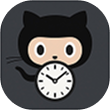
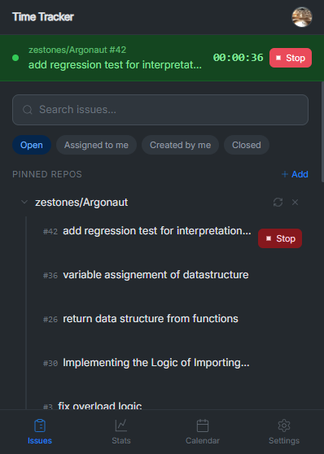
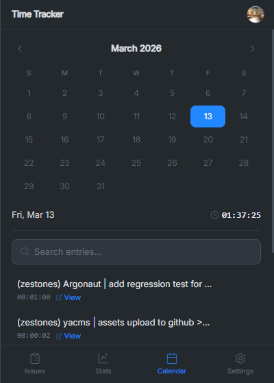
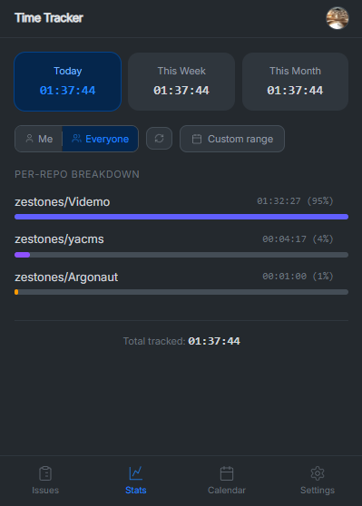
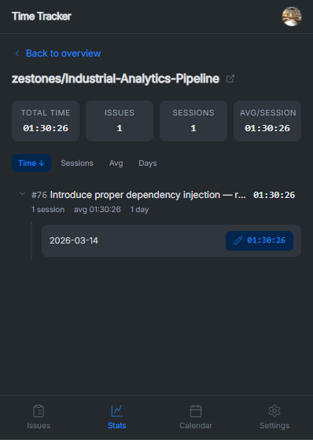
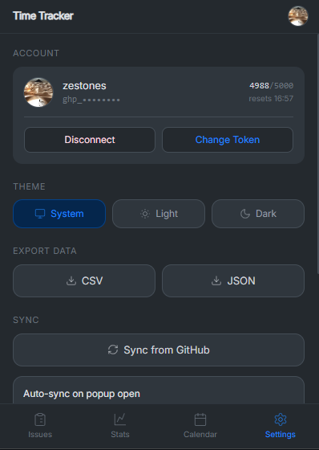
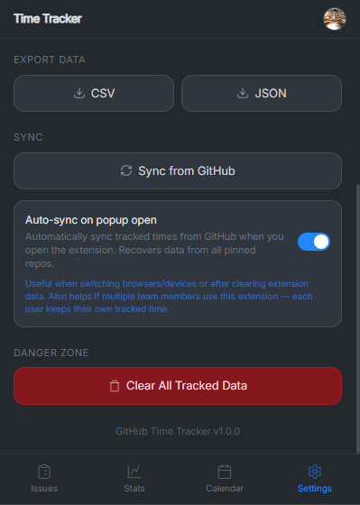
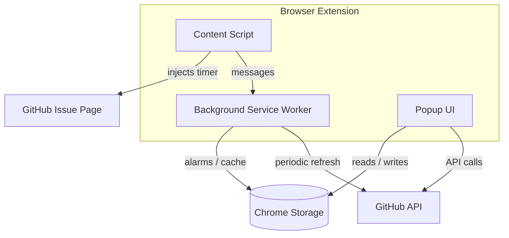

#  GitHub Time Tracker

 

_A feature-rich browser extension that brings time tracking directly into GitHub. Track time on issues, pin repositories, visualize your work in a calendar, analyze stats per repo, and collaborate with your team — all without leaving GitHub._

> [!NOTE]
> This project was forked and significantly expanded from [lywebdev/github-timetracker-extension](https://github.com/lywebdev/github-timetracker-extension).

## Screenshots

<table>
  <tr>
    <td align="center"><strong>Issues</strong></td>
    <td align="center"><strong>Calendar</strong></td>
    <td align="center"><strong>Stats</strong></td>
  </tr>
  <tr>
    <td></td>
    <td></td>
    <td></td>
  </tr>
  <tr>
    <td align="center"><strong>Repo Details</strong></td>
    <td align="center"><strong>Settings</strong></td>
    <td align="center"><strong>Settings</strong></td>
  </tr>
  <tr>
    <td></td>
    <td></td>
    <td></td>
  </tr>
</table>

---

## Features

### Time Tracking

A **Start / Stop Timer** button is injected directly on every GitHub issue page. It displays a real-time elapsed counter combining accumulated and current session time.

> [!NOTE]
> Starting a new timer automatically stops the previous one — preventing overlaps and ensuring accurate tracking. Timer state survives browser restarts and recovers gracefully from crashes.

### Issue Browser

Pin any GitHub repository for quick access from the extension popup. Browse, search, and filter issues by status (open, closed), assignee, or creator — and start or stop timers without leaving the popup.

> [!TIP]
> Issue lists are cached with a 5-minute TTL to keep API usage minimal even when switching between repos frequently.

### Calendar

An interactive monthly calendar highlights every day with tracked time. Click any day to see a full breakdown of issues worked on and total time spent. Entries are searchable and update live while a timer is running.

### Stats and Analytics

Summary cards display time tracked today, this week, and this month. A per-repository breakdown shows horizontal bar charts with percentage distribution. Drilling into a repository reveals total time, number of sessions, average session length, and days worked per issue — sortable by any of those dimensions. A custom date range picker allows filtering to any period.

> [!TIP]
> Forgot to stop a timer? Go to **Stats → repository → expand an issue** and click the session duration to manually correct it. Both local storage and the synced GitHub comment are updated instantly.

An **Everyone** mode fetches all team members' tracker comments from issues, providing aggregated analytics with individual contributor attribution.

### Sync and Data Recovery

The extension posts time sessions as formatted Markdown tables to GitHub issue comments. These comments double as a backup: tracked times can be recovered from them after data loss or when setting up on a new device.

> [!IMPORTANT]
> Auto-sync on popup open is available as an optional toggle in Settings. The merge logic only imports remote data when it exceeds local records — your local data is never silently overwritten.

### More Features

| Feature           | Details                                                                                            |
|-------------------|----------------------------------------------------------------------------------------------------|
| **Theme support** | System (auto-detect), Light, and Dark modes — preference persists across sessions                  |
| **Data export**   | Export as CSV or JSON — CSV includes formula injection protection                                  |
| **Settings**      | Masked token display, API rate limit indicator with reset countdown, token format validation       |
| **Offline-first** | All data in Chrome `storage.local` — background worker refreshes every 15 min, ~33k entry capacity |

---

## Architecture

The extension is composed of three independently built entry points:

- **Content Script** — monitors GitHub navigation and injects the timer button on issue pages. Communicates with the background worker to synchronize timer state across tabs.
- **Background Service Worker** — manages cache refresh alarms, timer persistence, and message forwarding between content scripts and the popup.
- **Popup UI** — the main interface with four tabs (Issues, Calendar, Stats, Settings). Built with Preact and Tailwind CSS.

---

## Tech Stack

| Layer                | Technology                                                                    |
|----------------------|-------------------------------------------------------------------------------|
| UI Framework         | [Preact](https://preactjs.com/)                                               |
| Styling              | [Tailwind CSS v4](https://tailwindcss.com/)                                   |
| Build Tool           | [Vite](https://vitejs.dev/) (separate configs for popup, background, content) |
| Linting / Formatting | [Biome](https://biomejs.dev/)                                                 |
| Type Checking        | TypeScript via JSDoc annotations                                              |
| Extension Manifest   | Manifest V3                                                                   |

---

## Getting Started

1. Install GitHub Time Tracker from the [Chrome Web Store](#).
2. Navigate to any GitHub issue — a **Start Timer** button appears automatically.
3. Open the extension popup to browse pinned repos, view the calendar, or check stats.
4. To fix a session after the fact, go to **Stats** → select a repository → expand an issue → click the session duration and save the corrected value.

> [!TIP]
> Add a GitHub Classic Personal Access Token in **Settings** to unlock commenting, syncing, and issue browsing features.

---

## Privacy

All data stays in your browser. No analytics, no telemetry, no external servers. The only network requests go to the GitHub API, authorized by your token, for features you explicitly use.

See the full [Privacy Policy](docs/privacy-policy.md).

---

## Links

- [Original Repository](https://github.com/lywebdev/github-timetracker-extension)
- [Privacy Policy](docs/privacy-policy.md)
