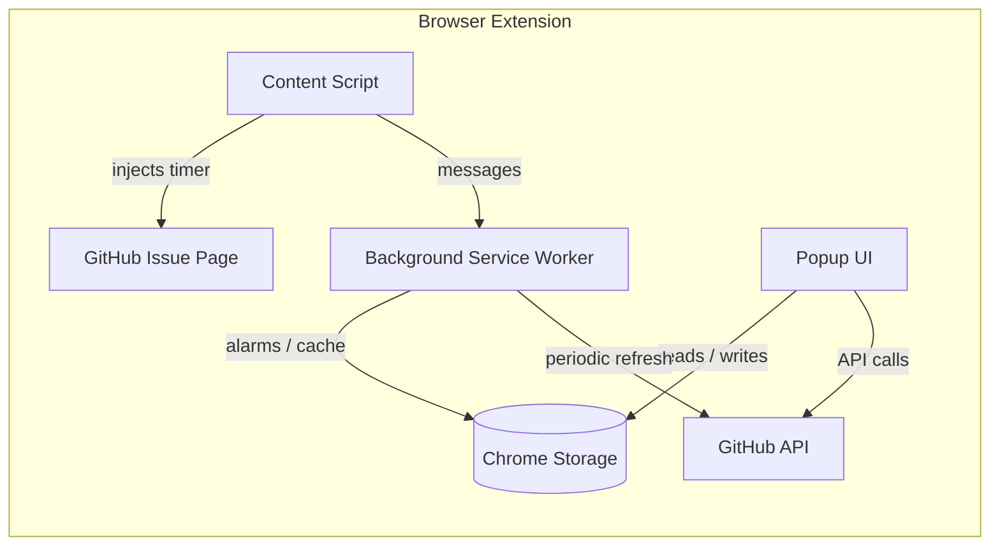

# GitHub Time Tracker

 

A feature-rich browser extension that brings time tracking directly into GitHub. Track time on issues, pin repositories, visualize your work in a calendar, analyze stats per repo, and collaborate with your team — all without leaving GitHub.

> [!NOTE]
> This project was forked and significantly expanded from [lywebdev/github-timetracker-extension](https://github.com/lywebdev/github-timetracker-extension).

---

## Features

### Inline Timer on GitHub Issues

A **Start / Stop Timer** button is injected directly on every GitHub issue page. It displays a real-time elapsed counter combining accumulated and current session time. When you start a new timer, the previous one stops automatically — preventing overlaps and ensuring accurate tracking.

### Pinned Repositories and Issue Browser

Pin any GitHub repository for quick access from the extension popup. From there, you can browse, search, and filter issues by status (open, closed), assignee, or creator. Timers can be started or stopped on any issue without navigating away from the popup. Issue lists are cached with a 5-minute TTL to minimize API calls.

### Calendar View

An interactive monthly calendar highlights days with tracked time. Clicking any day reveals a breakdown of tracked issues and total time spent. You can search within a selected day and see live updates while a timer is running.

### Stats and Analytics

Summary cards show time tracked today, this week, and this month. A per-repository breakdown uses horizontal bar charts with percentage distribution. Drilling down into a repository shows total time, number of sessions, average session length, and days worked per issue. Results can be sorted by time, sessions, average, or days — in ascending or descending order. A custom date range picker allows filtering to any period.

### Collaborative Time Tracking

An "Everyone" mode in the Stats tab fetches all team members' tracker comments from issues, providing aggregated team-wide analytics with individual contributor attribution.

### GitHub Sync and Data Recovery

The extension can recover tracked times from GitHub issue comments — useful after data loss or when setting up on a new device. Auto-sync on popup open is available as an optional toggle. The merge is intelligent: remote data is imported only when it exceeds local records. Time sessions are also posted as formatted Markdown tables directly to GitHub issues, keeping your team informed.

### Theme Support

Three modes are available: **System** (auto-detect from OS preference), **Light**, and **Dark**. The selected theme persists across sessions.

### Data Export

Tracked data can be exported as **CSV** (issue URL, title, seconds, date) or **JSON** (full structured data). CSV exports include formula injection protection.

### Settings

The settings panel displays your GitHub user profile with a masked token (first 4 characters only), an API rate limit indicator with reset countdown, and token format validation. A "Clear All Tracked Data" action is available with confirmation.

### Persistence

All data is stored locally via Chrome's `storage.local` API — the extension works fully offline. Timer state persists across browser restarts and recovers gracefully from crashes. A background service worker refreshes caches every 15 minutes. The estimated capacity is approximately 33,000 entries (3–4 years of heavy use) within the 5 MB storage limit.

---

## Architecture

The extension is composed of three independently built entry points:

- **Content Script** — monitors GitHub navigation and injects the timer button on issue pages. Communicates with the background worker to synchronize timer state across tabs.
- **Background Service Worker** — manages cache refresh alarms, timer persistence, and message forwarding between content scripts and the popup.
- **Popup UI** — the main interface with four tabs (Issues, Calendar, Stats, Settings). Built with Preact and Tailwind CSS.

---

## Tech Stack

| Layer                | Technology                                                                    |
|----------------------|-------------------------------------------------------------------------------|
| UI Framework         | [Preact](https://preactjs.com/)                                               |
| Styling              | [Tailwind CSS v4](https://tailwindcss.com/)                                   |
| Build Tool           | [Vite](https://vitejs.dev/) (separate configs for popup, background, content) |
| Linting / Formatting | [Biome](https://biomejs.dev/)                                                 |
| Type Checking        | TypeScript via JSDoc annotations                                              |
| Extension Manifest   | Manifest V3                                                                   |

---

## Getting Started

1. Install GitHub Time Tracker from the [Chrome Web Store](#).
2. Navigate to any GitHub issue — a **Start Timer** button appears automatically.
3. Open the extension popup to browse pinned repos, view the calendar, or check stats.

> [!TIP]
> Add a GitHub Classic Personal Access Token in **Settings** to unlock commenting, syncing, and issue browsing features.

---

## Privacy

All data stays in your browser. No analytics, no telemetry, no external servers. The only network requests go to the GitHub API, authorized by your token, for features you explicitly use.

See the full [Privacy Policy](docs/privacy-policy.md).

---

## Links

- [Original Repository](https://github.com/lywebdev/github-timetracker-extension)
- [Privacy Policy](docs/privacy-policy.md)
